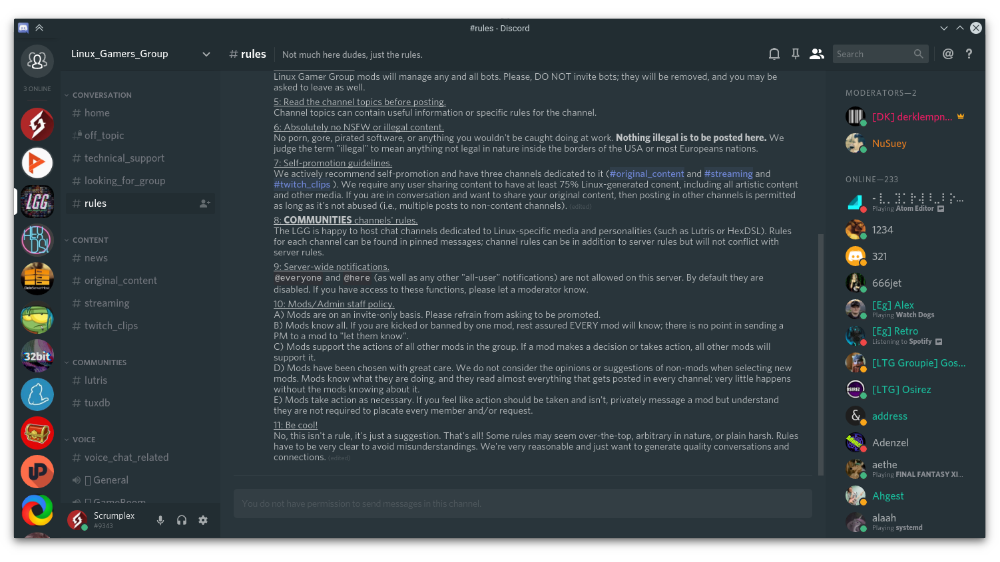
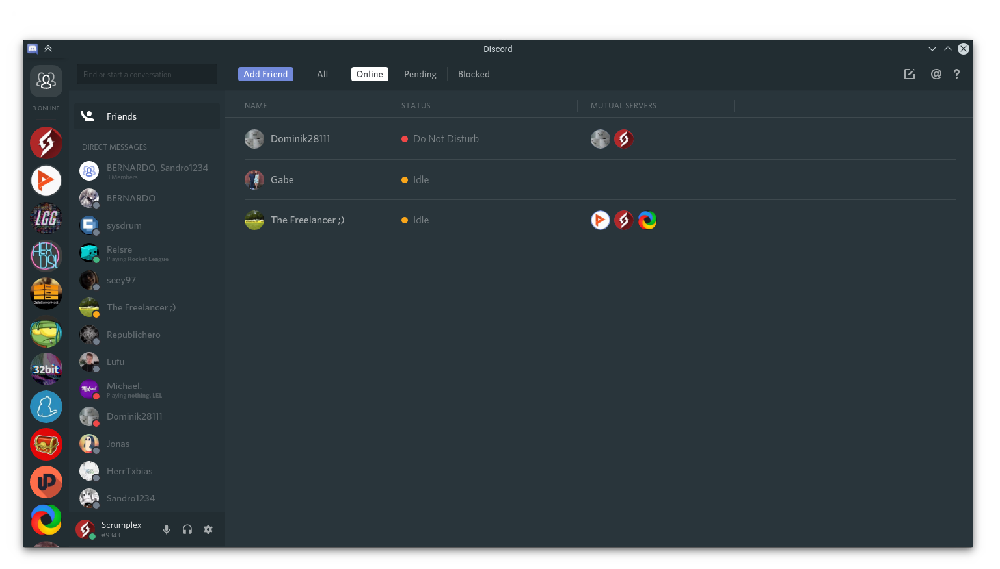
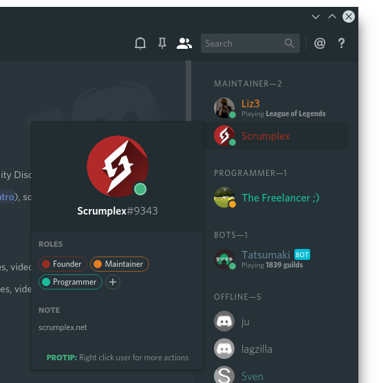
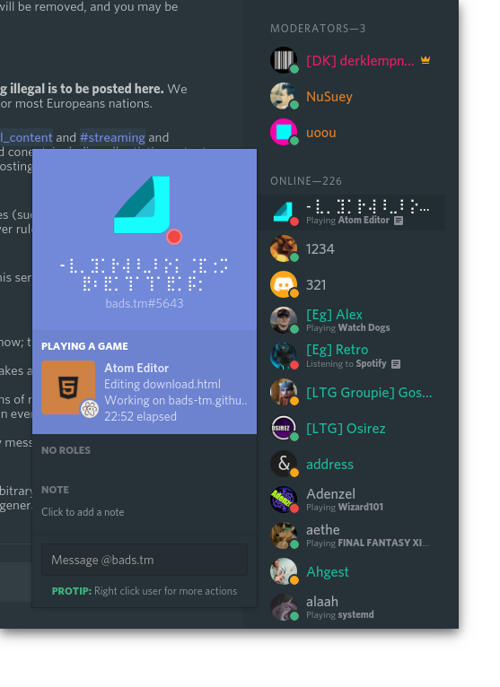

# Discord-Adapta-Nokto
A theme patch for Discord on Linux.

# Screenshots

# Support
For now this patch officially supports Discord 0.0.4 on Linux.

# Installation
Download and run the script [inject-adapta-nokto.sh](scripts/linux/inject-adapta-nokto.sh).

It will require a recent version of npm, because it needs to modify Electron specific files.

It will install the npm package [asar](https://github.com/electron/asar) globally in order to extract and pack files.

After the script has finished you can start Discord again and enable the default Dark Theme if not already enabled.

# Status

 - [x] Theme main UI (guilds-list, friends-list, channel-list, chat, ...)
 - [ ] Theme settings
 - [ ] Theme dialogs / modals
 - [ ] Theme start screen
 - [ ] Add support for other OS (presumably with BetterDiscord)
 - [ ] Add Adapta (Light) theme

# License
This project is licensed under the GNU General Public License v3. You can find more information about it in the [LICENSE](LICENSE) file.